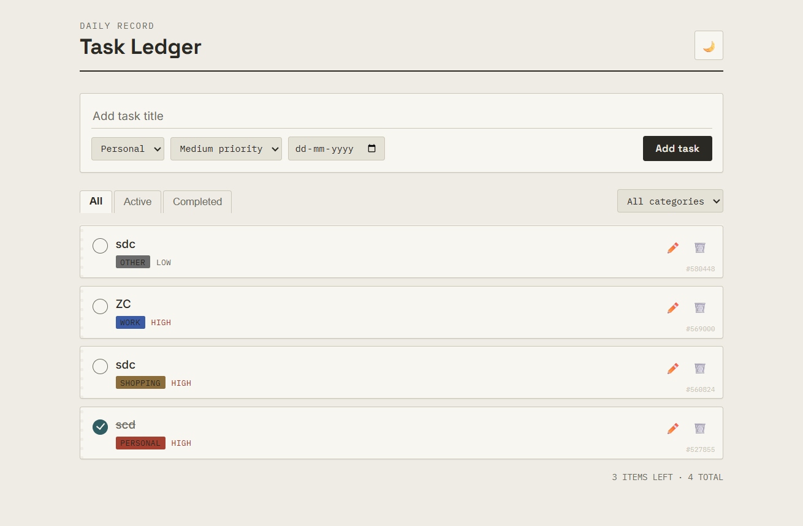

TASK LEDGER :  
its a demo task management application made with HTML, CSS and Vanilla JS.

Features :
1. theme toggle
2. add tasks
3. set priority
4. set date
5. filter by catagory
6. filter by status

Simple to start just start the index.html file with live server

Functionalities used:

- buildcard function used createElement to build new cards
- each card conatins custom properties : id, status and category
- input.value and input.getAttribute("value") usd
- dom manipulations
- event handling and event delegations
- event propogation

